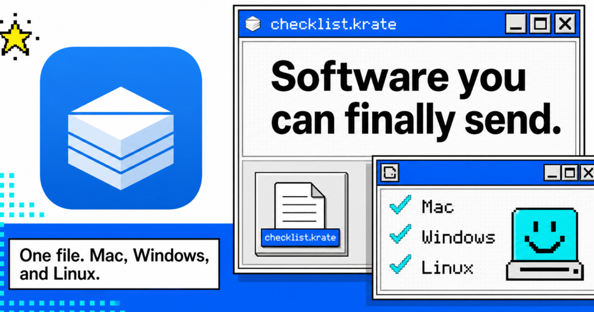

<p align="center">
  
</p>

<h1 align="center">Krate</h1>

<p align="center">
  <strong>Make apps with AI. Share them like documents.</strong>
</p>

<p align="center">
  One app file that opens on Mac, Windows, and Linux.<br>
  It shows what it wants to access before it runs.
</p>

<p align="center">
  <a href="https://github.com/incyashraj/krate/actions/workflows/ci.yml">
    
  </a>
  <a href="https://github.com/incyashraj/krate/releases">
    
  </a>
  <a href="LICENSE-MIT">
    
  </a>
</p>

<p align="center">
  <a href="https://krate.tech/">Website</a>
  ·
  <a href="https://krate.tech/docs/pages/krate-mode.html">Krate Mode</a>
  ·
  <a href="docs/mcp-setup.md">Connect to Claude or Cursor</a>
  ·
  <a href="https://krate.tech/docs/quickstart.html">Docs</a>
  ·
  <a href="https://github.com/incyashraj/krate/releases">Releases</a>
</p>

<p align="center">
  <a href="https://krate.tech/">
    
  </a>
</p>

## What is Krate?

AI can write a useful little app in a minute. Sharing it is still the hard part.
A web link cannot always reach the local machine. A normal desktop app can, but
it has to be packaged per operating system, and it can quietly reach far more of
your computer than you expected.

Krate is a simpler app format:

1. The app and the access it asks for go into one `.krate` file.
2. That same file opens on Mac, Windows, and Linux. The bytes do not change.
3. Krate shows you what it wants before it runs.
4. The app gets only what you allow, and nothing else.

A Krate app is a WebAssembly component compiled from ordinary Rust. It carries
no browser and no runtime of its own, so the apps in this repo have a median
size of **13.5 KB**. You install the runtime once; every app after that is
kilobytes.

Krate is open source, and the whole path works end to end: install it, describe an app, an AI writes it, and the file
it hands you opens on macOS, Windows and Linux.

## Make an app

Three ways, easiest first. All three run the build on your own machine, and all
three end at the same place: one `.krate` file you can send to someone.

### 1. Connect Krate to your AI and just talk

Krate ships an MCP server. Connect it once and you describe an app in chat and
get the finished file back. No commands at all.

Add this to Claude Desktop (Settings -> Developer -> Edit Config) or to
Cursor's `.cursor/mcp.json`:

```json
{
  "mcpServers": {
    "krate": {
      "command": "krate",
      "args": ["mcp"]
    }
  }
}
```

Restart the app, then ask for what you want:

> Build me a habit tracker that shows a weekly grid and remembers my streaks.
> Package it as a .krate.

The model reads Krate's real API, writes the app, builds it, checks it, and
hands you the file. A build takes two to five minutes, and it can tell you what
stage it is at while you wait. Full setup, including where the config file lives
on each system: [docs/mcp-setup.md](docs/mcp-setup.md).

### 2. Paste Krate Mode into any AI chat

No install, no connection, works in any chat window. Krate Mode is one prompt
that teaches a model to write correct Krate code. It is generated from the real
interface definitions, so it cannot drift out of date.

Read it at [krate.tech/docs/pages/krate-mode.html](https://krate.tech/docs/pages/krate-mode.html),
or print your own copy:

```bash
krate krate-mode
```

Paste it into the chat, ask for your app, then build the code it gives you with
`krate check-app`.

### 3. Type one word

```bash
krate
```

It asks what you want to make, shows which AI tools on your machine are ready
to write it, and builds the file. Nothing to remember and nothing to configure.

For a script, or if you would rather not be asked, the same thing in one line:

```bash
krate create "a habit tracker that remembers my streaks" \
  --output habit.krate \
  --agent claude
```

`--output` is required: it is where the finished file lands.

`--agent` picks who writes the code. Krate is not tied to one AI. Five are
supported today, and `krate ai` tells you which are already on your machine:

| `--agent` | Tool |
| --- | --- |
| `claude` | Claude Code |
| `codex` | OpenAI Codex CLI |
| `gemini` | Google Gemini CLI |
| `copilot` | GitHub Copilot CLI |
| `grok` | xAI Grok CLI |

For anything else, `--author-cmd "<your command>"` is the lower-level seam. It
receives `KRATE_REQUEST`, `KRATE_APP_NAME`, and `KRATE_APP_DIR`, and everything
after authoring stays the same.

Leave `--agent` off and Krate uses its own built-in generator, which needs no AI
tool at all.

### If Krate cannot build what you asked for, it says so

Ask for something outside what a sandboxed app can do and you find out in about
a second, not after a five-minute build:

```console
$ krate create "download my email" --output mail.krate --agent claude
error: Krate cannot build that: a Krate app runs in a sandbox and cannot read
the apps or libraries already on your computer, so it cannot get at your real
mail, photos, contacts, or messages.

Try instead: an app that works on files you pick yourself, or on data you type in.

Stopped before writing any code, so nothing was spent on an app that could not
have worked. If you think this is wrong, re-run with --force and Krate will
build what it can.
```

This is on purpose. Krate would rather refuse immediately than spend minutes
building something convincing that cannot do what you asked. The same check runs
in the MCP server, so it protects the chat path too.

## Open an app someone sent you

### Double-click it

The simplest way, and no terminal involved.

On macOS, download the `krate-app` zip for your Mac from the
[latest release](https://github.com/incyashraj/krate/releases/latest) and unzip
`Krate.app` into Applications. It is signed and notarized, so it opens
normally -- double-click any `.krate` file and a permission window appears
before the app runs.

On Windows and Linux, install the runtime below, then register `.krate` files
with [`scripts/install-krate-desktop.ps1`](scripts/install-krate-desktop.ps1) or
[`scripts/install-krate-desktop.sh`](scripts/install-krate-desktop.sh). After
that your file manager opens `.krate` files directly.

### Or from a terminal

Install the runtime. macOS and Linux:

```bash
curl -fsSL https://krate.tech/install.sh | sh
```

Windows PowerShell, no administrator rights needed:

```powershell
irm https://krate.tech/install.ps1 | iex
```

`irm` is a PowerShell alias, so that line does not work in Command Prompt.
From `cmd.exe`, type `powershell` first and then paste it.

Then run an app, from a file or straight from a URL:

```bash
krate run notes.krate --prompt
```

`--prompt` shows you each thing the app asks for and waits for your answer.

## What the permission wall actually does

A `.krate` file holds a WebAssembly component, the app's name and version, the
access it requests, and a reason for each request. Opening the file grants
nothing on its own. Krate builds a session from your answer and connects only
the operations you approved.

Look inside an app without running it:

```bash
krate run app.krate --dump-caps
```

Some of what the capabilities mean:

- `fs.read:notes/**` reads only inside the `notes` folder;
- `store.kv` gives the app its own storage addressed by name, so an app that
  remembers things needs no access to your folders at all;
- `store.sql` gives it a private SQLite database that cannot attach another
  database or reach a file through SQL;
- `store.secret` keeps tokens encrypted at rest, per app and per machine, so a
  copied file carries nothing usable to another computer;
- `ui.open-url` hands a link to your browser, limited to web and mail addresses,
  so a link cannot start a program or open a file;
- no network call works unless network access was declared and granted, and a
  redirect to a host you did not allow is not followed;
- an app downloaded from a URL gets no extra access for having come from one.

The strong version of this claim is mechanical rather than a promise: these apps
import **zero** `wasi:*` interfaces. A `wasi:*` import would be a door to the raw
operating system. There is no ambient access to leak because the door was never
built into the app. You can check any app yourself with
`wasm-tools component wit`.

## `krate check-app`: the thing that makes AI authoring work

An AI writing code needs a truthful, fast answer to "is this actually correct?"
That is `check-app`. It is the oracle behind all three authoring paths, and you
can run it yourself on any app directory:

```bash
krate check-app .
```

It runs six stages and prints one verdict. `OK` and exit 0 only when every stage
passes; otherwise it names the stage that failed, gives the fix, and exits with a
code an agent can branch on:

| Stage | Exit | What it proves |
| --- | --- | --- |
| layout | 10 | The directory has the files an app needs |
| manifest | 11 | The manifest is valid |
| build | 12 | It compiles, with the right toolchain |
| imports | 13 | It imports only `krate:*`, no `wasi:*` leak |
| run | 14 | It actually runs, headless |
| shoot | 15 | A GUI app paints a real frame |

`--json` gives an agent the same verdict as a machine-readable object. `--shoot
frame.png` writes the app's first frame to a PNG, so a GUI app's output can be
looked at rather than guessed about.

Because the failure text names the fix and not just the error, an agent can loop
on it without a human in the middle. That loop is why the paths above work.

## Where things stand

Working today: one `.krate` file that runs on Mac, Windows, and Linux; desktop
windows on all three; files, network, storage, and clipboard behind the
permission wall; running an app straight from an HTTPS URL; authoring through
MCP, Krate Mode, or the command line with five AI providers; `check-app`; and
JSON output for agents and scripts.

Krate Cloud is live at [krate.tech/cloud](https://krate.tech/cloud). Publish
with `krate publish yourapp.krate` or from
[krate.tech/publish](https://krate.tech/publish); either way it signs you in
with GitHub so the app carries your name, and anyone with the link can run it.

Not here yet: signing, updates, and discovery beyond a single listing.
Automatic conversion of an existing app or an opaque native binary is not
something Krate claims to do.

Known limits, stated plainly:

- The macOS app is not code-signed yet, so first open needs right-click Open.
- An AI has to write against the current Krate APIs, which are still changing.
- Permission review and desktop polish differ between operating systems.
- File formats and interfaces will change before 1.0.
- This is a first release, not a frozen API. Use it for your own apps and the
  published examples, not as
  a shield against hostile third-party code.

The runtime ships for six targets: macOS, Windows, and Linux, on both Intel and
ARM. CI runs on all three systems. See [STATUS.md](STATUS.md) for exact evidence
and [SECURITY.md](SECURITY.md) to report a security problem privately.

## Build from source

```bash
git clone https://github.com/incyashraj/krate
cd krate

cargo build --workspace
cargo test --workspace
cargo clippy --all-targets --all-features -- -D warnings
cargo fmt --all -- --check
```

The workspace has 956 tests.

You need the Rust toolchain named in `rust-toolchain.toml`, Git, your platform's
build tools, and `cargo-component` for building apps. Check your machine with
`krate doctor`.

### Linux

Five development packages, found one at a time on a machine with nothing
installed. Each is a separate failed build, and none of the errors names the
package you actually need:

```bash
sudo apt-get install build-essential pkg-config libssl-dev cmake \
  libasound2-dev libwayland-dev libxkbcommon-dev libudev-dev
```

```bash
sudo dnf install gcc-c++ pkgconf openssl-devel cmake \
  alsa-lib-devel wayland-devel libxkbcommon-devel systemd-devel
```

What each is for, and what it looks like when it is missing:

- **libasound2-dev** — the microphone capability. Stops in `alsa-sys` with a
  `pkg-config` error that does not explain itself.
- **libwayland-dev** — windowing. The worst failure of the five: a *panic
  inside `wayland-sys`'s build script*, which reads as a broken crate rather
  than a missing package.
- **libxkbcommon-dev** — the keyboard. Also needed at runtime: the versioned
  `libxkbcommon-x11.so.0` from the runtime package is not enough, because what
  gets loaded is the unversioned name that only `-dev` provides.
- **libudev-dev** — gamepads.
- **cmake** — builds whisper.cpp for speech-to-text. Skip the whole thing with
  `--no-default-features` if you do not need it.

### Windows

Visual Studio Build Tools with the "Desktop development with C++" workload.
Two things beyond that, both of which cost real time to discover:

- **libclang**, for the default feature set — whisper's bindgen needs it.
  Without it, build with `--no-default-features`.
- **A pagefile.** With 16 GB of RAM and no pagefile, the release link runs out
  of memory and Windows kills the process **with no message and an empty
  log**. Three builds died silently before that was the answer. An automatic
  pagefile fixes it.

Build just the CLI:

```bash
cargo build --release -p krate-cli
target/release/krate --version
```

## Repository map

```text
apps/       Sample apps and apps used to test Krate
crates/     Runtime, CLI, policy, adapters, MCP server, authoring, and SDK
docs/       Website, book, design records, and technical documentation
Plan/       Current and future implementation plans
scripts/    Build, install, test, evidence, and release tools
test/       Integration fixtures and cross-language tests
wit/        Krate interface definitions
```

## Documentation

| Start here | Link |
| --- | --- |
| Connect Krate to Claude Desktop or Cursor | [docs/mcp-setup.md](docs/mcp-setup.md) |
| The paste-in prompt for any AI chat | [Krate Mode](https://krate.tech/docs/pages/krate-mode.html) |
| Plain guide for making an app | [Make an app with AI](https://krate.tech/docs/pages/make-an-app-with-ai.html) |
| First app walkthrough | [Try Krate Notes](https://krate.tech/docs/try-krate-notes.html) |
| Developer quickstart | [Quickstart](https://krate.tech/docs/quickstart.html) |
| Product direction | [Vision](https://krate.tech/docs/vision.html) |
| Planned work | [Roadmap](https://krate.tech/docs/roadmap.html) |
| Exact current evidence | [Status](STATUS.md) |

## Contributing

Contributions are welcome across code, documentation, design, examples, and
testing. Start with [CONTRIBUTING.md](CONTRIBUTING.md), then
[good first issues](https://github.com/incyashraj/krate/labels/good%20first%20issue)
and [Discussions](https://github.com/incyashraj/krate/discussions). For a larger
change, open an issue before writing the full implementation. Everyone is held
to the [Code of Conduct](CODE_OF_CONDUCT.md).

## What Krate counts

Krate counts how many people use it, and nothing about them.

**Sent:** a random id made on your machine, the Krate version, the operating
system name, one of `install` / `make` / `open` / `publish`, whether an AI
wrote the app, and whether it worked.

**Never sent:** app names, prompts, file paths, your name, your email, your
hostname, or anything from inside an app. The id is random bytes written to
`~/.krate/install-id` -- not derived from your hardware, MAC address, or
hostname -- so it cannot be traced back to a person. Delete that file and this
becomes a new anonymous install.

It says so on first run rather than hiding in this file, and turning it off
changes nothing else:

```bash
krate telemetry off
```

`KRATE_NO_USAGE=1` does the same, and `DO_NOT_TRACK=1` is honoured too. The
request is fire-and-forget with a short timeout: a hub that is down or slow
costs about 16 milliseconds and can never change a command's result.

## Project status

- Stage: first release -- works end to end, API not yet frozen
- Current release:
  [`v0.1.6`](https://github.com/incyashraj/krate/releases/tag/v0.1.6)
- Company: Krate Labs
- Maintainer: [Yashraj Pardeshi](https://github.com/incyashraj)
- License: MIT OR Apache-2.0

Krate was previously named Layer36. The rename is complete.

## License

Choose either [MIT](LICENSE-MIT) or [Apache 2.0](LICENSE-APACHE). Contributions
use the same dual license.

## Acknowledgements

Krate builds on work from the
[Bytecode Alliance](https://bytecodealliance.org/),
[Wasmtime](https://wasmtime.dev/), the Rust community, and the wider WebAssembly
community.
