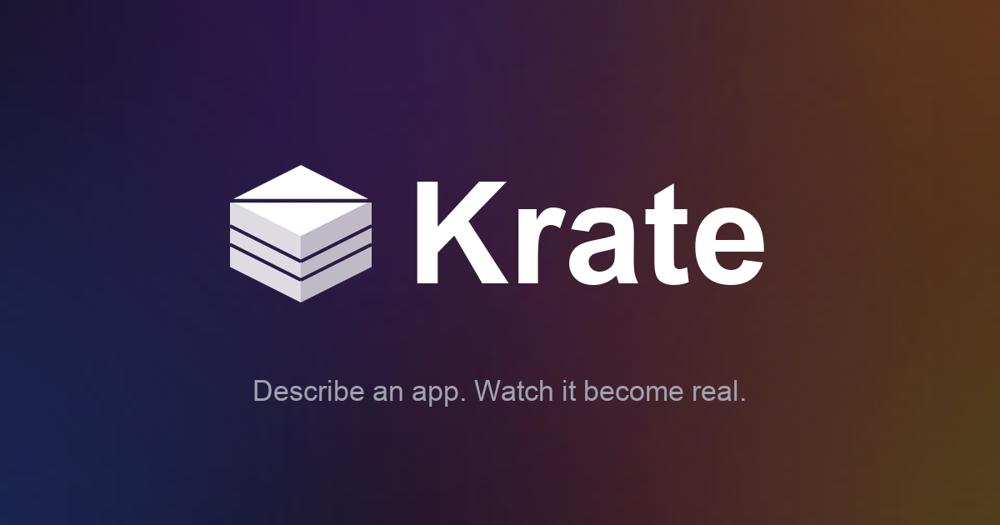
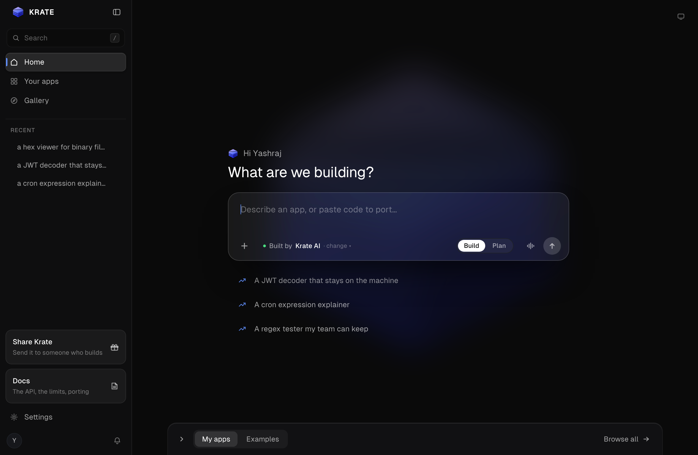

<p align="center">
  
</p>

<h1 align="center">Krate</h1>

<p align="center">
  <strong>Make an app. Send the file. It opens on Mac, Windows, and Linux.</strong>
</p>

<p align="center">
  Before it runs, the person opening it sees what it is allowed to touch.<br>
  The <strong>player</strong> is open source and installs once (~24 MB).
  <strong>Studio</strong> is how you make and send.
</p>

<p align="center">
  <a href="https://github.com/incyashraj/krate/actions/workflows/ci.yml">
    
  </a>
  <a href="https://github.com/incyashraj/krate/releases">
    
  </a>
  <a href="LICENSE-MIT">
    
  </a>
</p>

<p align="center">
  <a href="https://krate.tech/">Website</a>
  ·
  <a href="https://krate.tech/studio/">Krate Studio</a>
  ·
  <a href="https://krate.tech/docs/quickstart.html">Docs</a>
  ·
  <a href="https://github.com/incyashraj/krate/releases">Releases</a>
</p>

<p align="center">
  <a href="https://krate.tech/">
    
  </a>
</p>

## Use it

[Download Krate Studio](https://krate.tech/studio/), describe an app in
plain words, and send the file it gives you. The person you send it to
double-clicks it; the first time, Krate installs once (~24 MB, free,
this repository), and every later app just opens -- after showing them
exactly what it is allowed to touch.

Someone sent YOU a file? The friendly version lives at
[krate.tech/open](https://krate.tech/open/).

## 271 MB became 37 KB

The same 50,000-line notes workload, same Apple silicon Mac, head to head
against MarkText 0.17.1 (Electron). Historical internal measurements; an
architecture-matched public reproduction is in progress.

| | MarkText | Krate |
|---|---:|---:|
| The file itself | 271 MB installed | **37 KB** |
| Memory, 50,000 lines | 2.3 GB across five processes | **95 MB, one process** |
| Opens in | 1.8 s (17 s on its first run) | **0.2 s** |
| Idle CPU, document open | 21% of a core | **0.8%** |
| Scrolling | -- | **58 fps, jitter under 0.3 ms** |

Krate does not put another browser inside every app. Install the shared
player once, then every app is one file. Method and raw numbers: the
[lab note](evidence/benchmarks/2026-08-16-notes-battery-macos.md) and the
[reproducible benchmark kit](evidence/benchmarks/marktext-vs-krate/README.md).

## The software file for the AI era

AI can write a useful little app in a minute. Sharing it is still the hard
part: a web link needs hosting and can phone home, and a normal desktop app
has to be packaged per operating system.

1. The app and the access it asks for go into one `.krate` file.
2. That same file opens on Mac, Windows, and Linux. The bytes do not change.
3. Krate shows the person what it wants before it runs.
4. The app gets only what they allow, and nothing else.

A Krate app is a WebAssembly component compiled from ordinary Rust. It
carries no browser and no per-app runtime: a playable game is **13 KB** and
the notes editor in the benchmark is **37 KB**.

## Krate Studio

<p align="center">
  
</p>

Studio detects which AI tools are installed, so you pick one with a click,
describe what you want, and watch the app being made and checked. No
terminal, no project setup. The file carries its own source, so "make the
button blue" edits the app you have. Download from
[krate.tech/studio](https://krate.tech/studio/) -- signed `.dmg` on macOS,
installer on Windows (unsigned for now, so SmartScreen asks once), AppImage
on Linux.

## What it costs

- **Free** -- open any `.krate`, forever. Make three apps a month; changes
  to an app and failed builds never count.
- **Studio** -- unlimited making at **$12 a month or $96 a year** when
  Studio leaves preview. Free while it is in preview, and nothing is
  charged today.
- **Founding 200** -- the first 200 people on
  [the list](https://krate.tech/studio/#founding) lock Studio at
  **$79 a year** for as long as they stay.

Making uses the coding AI you already pay for -- Claude, Codex, Gemini,
Copilot, Grok -- and Krate never holds its keys.

## The permission wall

A `.krate` holds a WebAssembly component, the app's name, the access it
requests, and a reason for each request. Opening the file grants nothing on
its own; Krate connects only the operations the person approved. Look
inside any app without running it:

```bash
krate run app.krate --dump-caps
```

- `fs.read:notes/**` reads only inside the `notes` folder;
- `store.kv` / `store.sql` give an app private storage, so remembering
  things needs no access to your folders at all;
- no network call works unless network access was declared and granted, and
  a redirect to a host you did not allow is not followed;
- an app downloaded from a URL gets no extra access for having come from one.

The strong version of the claim is mechanical, not a promise: these apps
import **zero** `wasi:*` interfaces. There is no ambient access to leak
because the door was never built into the app. Check any app yourself with
`wasm-tools component wit`.

---

## Work on it

Everything above is for using Krate. Everything below is the machinery:
the player, the `.krate` format, and `krate check-app` live in this
repository; Krate Studio and the hub are the product layer (`studio/`
and `cloud/`). If you came here to send an app to someone, you already
have everything you need -- download Studio and go.

## A terminal or your own AI tools

Studio is the recommended way to make an app. For people who live in a
shell or want their own AI driving Krate, all paths end at the same
`.krate` file:

- **MCP**: `krate mcp` is a server Claude Desktop or Cursor can call; add
  `{"mcpServers": {"krate": {"command": "krate", "args": ["mcp"]}}}` to the
  app's MCP config and ask for the app in chat. Full setup:
  [docs/mcp-setup.md](docs/mcp-setup.md).
- **Krate Mode**: one paste-in prompt that teaches any AI chat to write
  correct Krate code, generated from the real interface definitions.
  `krate krate-mode` prints it;
  [read it online](https://krate.tech/docs/pages/krate-mode.html).
- **One word**: `krate` asks what you want and builds it. In one line:
  `krate create "a habit tracker" --output habit.krate --agent claude`.
  Five agents are supported (`claude`, `codex`, `gemini`, `copilot`,
  `grok`); `krate ai` says which are ready, and `--author-cmd` is the seam
  for anything else.

Ask for something a sandboxed app cannot be -- "download my email" -- and
`krate create` refuses in about a second with the reason and a suggestion,
instead of spending five minutes building something convincing that could
never work.

## `krate check-app`: the oracle behind AI authoring

An AI writing code needs a truthful, fast answer to "is this actually
correct?" `check-app` runs six stages and prints one verdict; because the
failure text names the fix, an agent can loop on it without a human in the
middle.

| Stage | Exit | What it proves |
| --- | --- | --- |
| layout | 10 | The directory has the files an app needs |
| manifest | 11 | The manifest is valid |
| build | 12 | It compiles, with the right toolchain |
| imports | 13 | It imports only `krate:*`, no `wasi:*` leak |
| run | 14 | It actually runs, headless |
| shoot | 15 | A GUI app paints a real frame |

`--json` gives the same verdict as a machine-readable object; `--shoot
frame.png` writes the app's first frame to a PNG so output can be looked at
rather than guessed about.

## Where things stand

One `.krate` runs on Mac, Windows, and Linux, GPU-rendered with a CPU
fallback; files, network, storage, and clipboard sit behind the permission
wall; apps run from a file or straight from an HTTPS URL; publishing a
link works from Studio, `krate publish`, or
[krate.tech/publish](https://krate.tech/publish). Exact evidence:
[STATUS.md](STATUS.md).

Known limits, stated plainly:

- Windows and Linux studio builds are unsigned for now; macOS is signed and
  notarised by Apple.
- An AI has to write against the current Krate APIs, which are still changing.
- Permission review and desktop polish differ between operating systems.
- File formats and interfaces will change before 1.0.
- This is a young product, not a frozen API. Use it for your own apps and
  the published examples, not as a shield against hostile third-party code.

## Build from source

```bash
git clone https://github.com/incyashraj/krate
cd krate
cargo build --workspace && cargo test --workspace
```

The workspace has 1,220 Rust tests. You need the Rust toolchain named in
`rust-toolchain.toml` and `cargo-component`; check your machine with
`krate doctor`. Platform packages, the two Windows traps, and the
one-package Linux receiver note live in [docs/build.md](docs/build.md).

## Repository map

```text
apps/       Sample apps and apps used to test Krate
crates/     Runtime, CLI, policy, adapters, MCP server, authoring, and SDK
docs/       Website, book, design records, and technical documentation
Plan/       Current and future implementation plans
scripts/    Build, install, test, evidence, and release tools
test/       Integration fixtures and cross-language tests
wit/        Krate interface definitions
```

## Documentation

| Start here | Link |
| --- | --- |
| Connect Krate to Claude Desktop or Cursor | [docs/mcp-setup.md](docs/mcp-setup.md) |
| The paste-in prompt for any AI chat | [Krate Mode](https://krate.tech/docs/pages/krate-mode.html) |
| Plain guide for making an app | [Make an app with AI](https://krate.tech/docs/pages/make-an-app-with-ai.html) |
| Developer quickstart | [Quickstart](https://krate.tech/docs/quickstart.html) |
| Build from source | [docs/build.md](docs/build.md) |
| Exact current evidence | [Status](STATUS.md) |

## Contributing

Contributions are welcome across code, documentation, design, examples, and
testing. Start with [CONTRIBUTING.md](CONTRIBUTING.md), then
[good first issues](https://github.com/incyashraj/krate/labels/good%20first%20issue)
and [Discussions](https://github.com/incyashraj/krate/discussions). For a
larger change, open an issue before writing the full implementation.
Everyone is held to the [Code of Conduct](CODE_OF_CONDUCT.md).

## What Krate counts

A random id made on your machine, the Krate version, the OS name, one of
`install` / `make` / `open` / `publish`, whether an AI wrote the app, and
whether it worked. Never: app names, prompts, paths, or anything about you.
`krate telemetry off` turns it off (`DO_NOT_TRACK=1` is honoured too), and
it says so on first run rather than hiding here.

## Project status

- Stage: public beta, works end to end, API not yet frozen
- Current release: [the latest on the releases page](https://github.com/incyashraj/krate/releases/latest)
- Company: Krate Labs
- Maintainer: [Yashraj Pardeshi](https://github.com/incyashraj)
- License: MIT OR Apache-2.0

Krate was previously named Layer36. The rename is complete.

## License

Choose either [MIT](LICENSE-MIT) or [Apache 2.0](LICENSE-APACHE).
Contributions use the same dual license.

## Acknowledgements

Krate builds on work from the
[Bytecode Alliance](https://bytecodealliance.org/),
[Wasmtime](https://wasmtime.dev/), the Rust community, and the wider
WebAssembly community.
