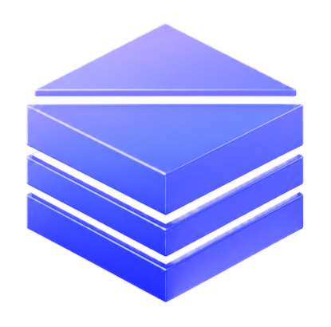
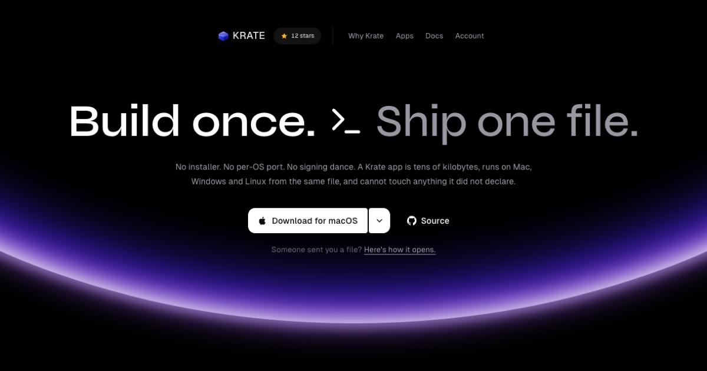

<p align="center">
  
</p>

<h1 align="center">Krate</h1>

<p align="center">
  <strong>Build desktop software once. Ship one .krate file.</strong>
</p>

<p align="center">
  The same application file runs through native Krate runtimes on macOS, Windows and Linux.<br>
  Share the app, its assets and its requested permissions.<br>
  No separate application build per OS.
</p>

<p align="center">
  <a href="https://github.com/incyashraj/krate/actions/workflows/ci.yml">
    
  </a>
  <a href="https://github.com/incyashraj/krate/releases">
    
  </a>
  <a href="LICENSE-MIT">
    
  </a>
</p>

<p align="center">
  <a href="https://krate.tech/">Website</a>
  ·
  <a href="https://krate.tech/studio/">Krate Studio</a>
  ·
  <a href="https://krate.tech/docs/quickstart.html">Docs</a>
  ·
  <a href="https://github.com/incyashraj/krate/releases">Releases</a>
</p>

<p align="center">
  <a href="https://krate.tech/">
    
  </a>
</p>

## Start with the runtime

Krate is for developers who want a shared application artifact, not just a
shared codebase. Build once, send the file, and let the native runtime handle
the platform.

Install the CLI/runtime on the machine that will open the app. These commands
download and execute the published installer; read the
[Unix script](scripts/install.sh) or [PowerShell script](scripts/install.ps1)
first, or download a matching archive from
[Releases](https://github.com/incyashraj/krate/releases/latest).

**macOS or Linux**

```sh
curl -fsSL https://krate.tech/install.sh | sh
```

**Windows PowerShell**

```powershell
irm https://krate.tech/install.ps1 | iex
```

For a `.krate` file you received from a trusted source:

```sh
krate --version
krate run app.krate --dump-caps
krate run app.krate --prompt
```

Replace `app.krate` with your downloaded file. Inspection does not execute
the application. Review permissions before granting them. Running a packaged
app does not require the author's Rust toolchain or AI account; Linux X11
users may need [an additional system library](docs/build.md#running-an-app-on-linux-without-building-anything).

## Build your app

| Your starting point | Next step |
| --- | --- |
| Write the code yourself | [Developer quickstart](https://krate.tech/docs/quickstart.html) and [Rust SDK](crates/bindings-rust/README.md) |
| Bring an existing project | [Porting guide](https://krate.tech/docs/porting.html); start with the read-only `krate port ./my-project` scan |
| Build with AI | [Krate Studio](https://krate.tech/studio/) or the CLI example below |
| Evaluate the architecture | [Portable format](https://krate.tech/portable-desktop-app-format.html), [distribution comparison](https://krate.tech/desktop-app-distribution.html) and [current limits](https://krate.tech/docs/limits.html) |

For CLI authoring, you need the Rust/component build tools and an installed,
authenticated coding agent. Check the environment first; the agent's own
subscription or API charges are separate from Krate:

```sh
krate doctor
krate ai
krate create "a regex tester with a pattern box and live matches" --agent claude --output regex.krate
krate run regex.krate --dump-caps
krate run regex.krate --prompt
```

`krate check-app` checks build, imports and basic execution/rendering. You still
need to use the app, test its behavior and test the same artifact on each OS
you intend to support. A passing build is not a functional or security audit.

## Nothing installed? Start in the browser

[krate.tech/app](https://krate.tech/app/) is Krate Studio in a tab. Describe
the app you want and **Krate AI** writes it, builds it on our machines and
hands back a `.krate` you can download and run. No install, no toolchain, no
API key of your own.

Your first app is on us, and so is your first change to it. After that,
Krate Studio on your own machine is free and unlimited when you point it at
an AI you already have (Claude, Codex, Gemini, or an API key you hold). The
session follows your account, so anything you start in the browser opens on
the desktop ready to edit.

## A measured notes workload

The same 50,000-line notes workload, same Apple M4 Mac, head to head against
MarkText 0.17.1 (Electron), measured on 25 August 2026. Both builds ARM64.
This is an equivalent document workload, not full editor feature parity
or a prediction for every Krate app. Raw samples, input digests and machine
state are retained beside the run.

| | MarkText | Krate |
|---|---:|---:|
| Installed app / component payload (different boundaries) | 284.6 MiB installed | **36.6 KiB payload**, runtime excluded |
| Memory, 50,000 lines | 2,299.4 MiB across four processes | **178.5 MiB, one process** |
| Warm open, 50,000 lines | 611.5 ms median of 10 | **237.1 ms median of 10** |

Krate does not put another browser inside every app. The 36.6 KiB is the
per-app payload: the shared player is installed once at 88.6 MiB, so the
runtime plus this measured payload is about 3.21 times smaller than the
MarkText installed application. This does not include the editable source
bundle, saved user data or the authoring toolchain. Further apps still add
their own code, assets and data.

The `.krate` file you actually send is bigger than its payload, because it
can carry source, SDK interfaces and assets beside the compiled code. Compare
the complete download with other downloads, and the installed runtime plus
app with other installed applications. Payload size is not download size.

Method, raw samples and seal: the
[reproducible benchmark kit](evidence/benchmarks/marktext-vs-krate/README.md)
and [this run](evidence/benchmarks/marktext-vs-krate/runs/20260825T085644Z/analysis.md).
Energy was not measured and no battery-life claim is made from it.

## Why a file

Cross-platform frameworks can share source while still producing separate
application packages for each platform. Krate moves the platform-specific
part into a shared runtime and makes the application artifact portable.

1. The app and the access it asks for go into one `.krate` file.
2. That same file opens on Mac, Windows, and Linux. The bytes do not change.
3. Krate shows the person what it wants before it runs.
4. Host operations are checked against the session's capabilities.

A Krate app is a WebAssembly component compiled from ordinary Rust. It
carries no browser engine or per-app native runtime. Package size depends on
code, source, dependencies and assets; there is no universal size promise.
The goal is to make `.krate` a standard way developers ship software.
Today, that depends on the app fitting Krate's supported interfaces.

## Krate Studio

<p align="center">
  
</p>

Studio runs the same engine the CLI does: build, import-check, run and
pack, with the engine's real output on screen, not a summary of it. It uses
the coding AI you already have installed and pay for, and stays out of the
way if you would rather write the code yourself. Every `.krate` carries its
own source, so a build you shipped a year ago opens as a project you can
edit.

It runs in two places, and they are the same interface rather than two
lookalikes:

- **In a browser**, at [krate.tech/app](https://krate.tech/app/). Krate AI
  does the writing and the build happens on our machines. Nothing to
  install, and your first app and first change are free.
- **On your machine**, from [krate.tech/studio](https://krate.tech/studio/).
  Signed `.dmg` on macOS, installer on Windows (unsigned for now, so
  SmartScreen asks once), AppImage on Linux. Free and unlimited with your
  own AI.

Sessions live on your account, so an app you start in the browser opens on
the desktop with its conversation intact and editable.

## What it costs

Nothing, right now. The player is MIT and Apache licensed and always will
be. The CLI and Krate Studio on your own machine are free and uncapped,
and we will say so long before that changes.

The one thing with a limit is the inference we pay for. Krate AI in the
browser writes your first app and your first change to it on us; after
that, making is unlimited on your own machine with an AI you already have.

If you point Krate at your own coding AI, that stays your subscription and
Krate never holds its keys.

## The permission wall

A `.krate` holds a WebAssembly component, the app's name, the access it
requests, and a reason for each request. Opening the file grants nothing on
its own; Krate connects only the operations the person approved. Look
inside any app without running it:

```bash
krate run app.krate --dump-caps
```

- `fs.read:notes/**` reads only inside the `notes` folder;
- `store.kv` / `store.sql` give an app private storage, so remembering
  things needs no access to your folders at all;
- no network call works unless network access was declared and granted, and
  a redirect to a host you did not allow is not followed;
- an app downloaded from a URL gets no extra access for having come from one;
- the camera, the microphone, speech and sound sit behind the same wall, so
  an app that wants to see or hear you has to say so first;
- a file you pick or drag onto a window is handed over as a name and a
  token, never a path, so the app opens that one file and cannot walk to its
  folder or come back for it on a later run;
- `store.shared` and `net.ws` are the multiplayer pair: a bucket two
  machines share through an invite code, and a live two-way connection.

The strong version of the claim is mechanical, not a promise: these apps
import **zero** `wasi:*` interfaces. There is no ambient access to leak
because the door was never built into the app. Check any app yourself with
`wasm-tools component wit`.

---

## Work on it

Everything above is what Krate does. Everything below is the machinery:
the player, the `.krate` format, and `krate check-app` live in this
repository; Krate Studio and the hub are the product layer (`studio/`
and `cloud/`).

## A terminal or your own AI tools

Studio is one front end for the engine, not the only one. Whichever you
pick, every path ends at the same `.krate` file:

- **MCP**: `krate mcp` is a server Claude Desktop or Cursor can call; add
  `{"mcpServers": {"krate": {"command": "krate", "args": ["mcp"]}}}` to the
  app's MCP config and ask for the app in chat. Full setup:
  [docs/mcp-setup.md](docs/mcp-setup.md).
- **Krate Mode**: one paste-in prompt that teaches any AI chat to write
  correct Krate code, generated from the real interface definitions.
  `krate krate-mode` prints it;
  [read it online](https://krate.tech/docs/pages/krate-mode.html).
- **One word**: `krate` asks what you want and builds it. In one line:
  `krate create "a habit tracker" --output habit.krate --agent claude`.
  Five agents are supported (`claude`, `codex`, `gemini`, `copilot`,
  `grok`); `krate ai` says which are ready, and `--author-cmd` is the seam
  for anything else.

Ask for something a sandboxed app cannot be, like "download my email", and
`krate create` refuses in about a second with the reason and a suggestion,
instead of spending five minutes building something convincing that could
never work.

## `krate check-app`: the oracle behind AI authoring

An AI writing code needs a truthful, fast answer to "is this actually
correct?" `check-app` runs six stages and prints one verdict; because the
failure text names the fix, an agent can loop on it without a human in the
middle.

| Stage | Exit | What it proves |
| --- | --- | --- |
| layout | 10 | The directory has the files an app needs |
| manifest | 11 | The manifest is valid |
| build | 12 | It compiles, with the right toolchain |
| imports | 13 | It imports only `krate:*`, no `wasi:*` leak |
| run | 14 | It actually runs, headless |
| shoot | 15 | A GUI app paints a real frame |

`--json` gives the same verdict as a machine-readable object; `--shoot
frame.png` writes the app's first frame to a PNG so output can be looked at
rather than guessed about.

## Where things stand

One `.krate` runs on Mac, Windows, and Linux, GPU-rendered with a CPU
fallback; files, network, storage, and clipboard sit behind the permission
wall; apps run from a file or straight from an HTTPS URL; publishing a
link works from Studio, `krate publish`, or
[krate.tech/publish](https://krate.tech/publish). Exact evidence:
[STATUS.md](STATUS.md).

Known limits, stated plainly:

- Apps use Krate's interfaces. Existing native binaries, Electron apps and
  Tauri apps need a port, not a file-extension change. Check
  [capability limits](https://krate.tech/docs/limits.html) and the
  [porting guide](https://krate.tech/docs/porting.html).
- Windows and Linux studio builds are unsigned for now; macOS is signed and
  notarised by Apple.
- An AI has to write against the current Krate APIs, which are still changing.
- Permission review and desktop polish differ between operating systems.
- File formats and interfaces will change before 1.0.
- This is a young product, not a frozen API. Use it for your own apps and
  the published examples, not as a shield against hostile third-party code.

## Build from source

```bash
git clone https://github.com/incyashraj/krate
cd krate
cargo build --workspace && cargo test --workspace
```

The workspace has over 1,600 Rust tests. You need the Rust toolchain named in
`rust-toolchain.toml` and `cargo-component`; check your machine with
`krate doctor`. Platform packages, the two Windows traps, and the
one-package Linux receiver note live in [docs/build.md](docs/build.md).

## Repository map

```text
apps/       Sample apps and apps used to test Krate
crates/     Runtime, CLI, policy, adapters, MCP server, authoring, and SDK
docs/       Website, book, design records, and technical documentation
Plan/       Current and future implementation plans
scripts/    Build, install, test, evidence, and release tools
test/       Integration fixtures and cross-language tests
wit/        Krate interface definitions
```

## Documentation

| Start here | Link |
| --- | --- |
| Connect Krate to Claude Desktop or Cursor | [docs/mcp-setup.md](docs/mcp-setup.md) |
| The paste-in prompt for any AI chat | [Krate Mode](https://krate.tech/docs/pages/krate-mode.html) |
| Plain guide for making an app | [Make an app with AI](https://krate.tech/docs/pages/make-an-app-with-ai.html) |
| Developer quickstart | [Quickstart](https://krate.tech/docs/quickstart.html) |
| Build from source | [docs/build.md](docs/build.md) |
| Exact current evidence | [Status](STATUS.md) |

## Contributing

Contributions are welcome across code, documentation, design, examples, and
testing. Start with [CONTRIBUTING.md](CONTRIBUTING.md), then
[good first issues](https://github.com/incyashraj/krate/labels/good%20first%20issue)
and [Discussions](https://github.com/incyashraj/krate/discussions). For a
larger change, open an issue before writing the full implementation.
Everyone is held to the [Code of Conduct](CODE_OF_CONDUCT.md).

## What Krate counts

A random id made on your machine, the Krate version, the OS name, one of
`install` / `make` / `open` / `publish`, whether an AI wrote the app, and
whether it worked. Never: app names, prompts, paths, or anything about you.
`krate telemetry off` turns it off (`DO_NOT_TRACK=1` is honoured too), and
it says so on first run rather than hiding here.

## Project status

- Stage: public beta, works end to end, API not yet frozen
- Current release: [the latest on the releases page](https://github.com/incyashraj/krate/releases/latest)
- Company: Krate Labs
- Maintainer: [Yashraj Pardeshi](https://github.com/incyashraj)
- License: MIT OR Apache-2.0

Krate was previously named Layer36. The rename is complete.

## License

Open core, split by what each piece is for:

| Piece | License |
| --- | --- |
| Player, `.krate` format, CLI, runtime: everything a receiver trusts | [MIT](LICENSE-MIT) OR [Apache 2.0](LICENSE-APACHE) |
| Krate Studio (`studio/`) and the hub worker (`cloud/worker/`) | [Business Source License 1.1](studio/LICENSE), converts to Apache 2.0 in 2030 |

The BSL lets you read, build, and use Studio; it stops a competing hosted
Studio. Versions published before the split remain under their original
MIT OR Apache terms. Contributions to the player use the dual license.

## Acknowledgements

Krate builds on work from the
[Bytecode Alliance](https://bytecodealliance.org/),
[Wasmtime](https://wasmtime.dev/), the Rust community, and the wider
WebAssembly community.
