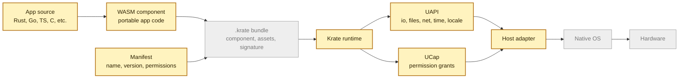
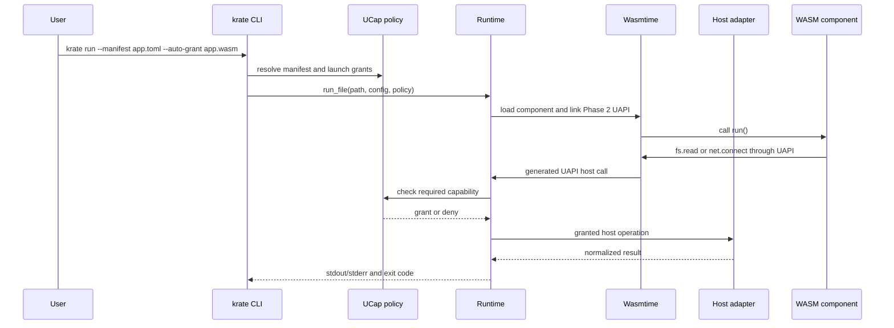
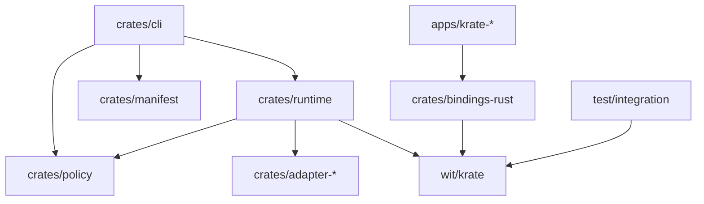

# Architecture

Krate has one job: keep app code above the platform line.

An app should not need to know whether it is running on Linux, Windows, macOS,
Android, or iOS for common work. It should call Krate. The host adapter should
do the platform work.

## Full Shape Of The System

Phase 2 has the yellow part: WebAssembly components, manifests, the runtime,
UAPI slices, UCap checks, and early host adapter paths. The `.krate` bundle,
GUI APIs, mobile hosts, signing, and distribution are later phases.

## Runtime Flow Today

## What The Current Proof Shows

Phase 1 proved that the loader works: one hello-world component can run through
the Krate runtime. Phase 2 builds on that with useful app calls. The current
proof shows:

- `krate-clock` can use time, locale, timezone, and stdout.
- `krate-cat` can read granted files and deny missing or out-of-scope file
  grants.
- `krate-curl` can fetch a granted local HTTP endpoint and deny missing
  network grants.
- sample and UCap evidence scripts can record repeatable reports for exit
  review.

That matters because the promise is not "three hosts can build similar source."
The promise is "one app artifact can run under the same runtime model on
different hosts."

## Crates Today

`crates/runtime` owns loading, Wasmtime setup, generated UAPI host bindings,
fuel, memory limits, resource tables, adapter calls, and runtime errors.

`crates/cli` owns arguments, manifests, launch grants, output, exit codes, and
developer diagnostics.

`crates/policy` owns UCap session policy and capability matching.

`crates/adapter-*` owns OS-specific host behavior behind the shared runtime
boundary.

## Trust Boundary

The WebAssembly component is untrusted. The runtime, policy, and host adapters
are trusted project code. The operating system is outside the project boundary.

Phase 2 has real capability checks for the current UAPI slice, but it is not a
production sandbox. Do not run untrusted third-party components yet. The current
goal is to prove that host access can be declared, granted, denied, and recorded
before Krate moves into GUI and distribution work.

## Later Phases

Phase 3 adds desktop UI and graphics. Phase 4 adds mobile hosts. Later phases
add SDK polish, app bundles, signing, identity, updates, marketplace behavior,
and release hardening.
