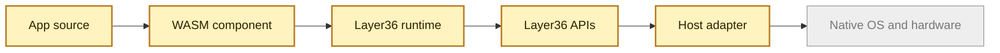

# Introduction

Layer36 is an attempt to make apps portable in the way files are portable.

The goal is simple to say and hard to build:

> Write one app. Run it on Windows, Linux, macOS, Android, iOS, ChromeOS, and
> the web through the same Layer36 runtime model.

Today every platform has its own SDK, app format, permission model, UI rules,
and hardware APIs. That is why the same product often becomes six different
codebases. Layer36 puts one common layer in the middle.

## The Core Idea

An app compiles to WebAssembly. The app does not call Windows, Android, or iOS
directly. It calls Layer36 APIs. Each host then translates those calls into the
native platform underneath.

What exists today is a pre-alpha Phase 2 runtime slice. Layer36 can run
WebAssembly components through the CLI, route app calls through UAPI modules,
check manifest-declared capabilities, and exercise sample apps for clock, file
reads, and local HTTP. The wider platform APIs, GUI, mobile hosts, bundles, and
distribution are still later work.

## What We Have Built So Far

- A Rust workspace and public GitHub project.
- A `layer36` CLI with `run`, `version`, `doctor`, and manifest commands.
- A Wasmtime based runtime that loads WebAssembly components.
- Phase 2 UAPI slices for `io`, `fs`, `net`, `time`, and `locale`.
- UCap manifests, launch grants, policy checks, and grant logs.
- Sample apps for `layer36-clock`, `layer36-cat`, and `layer36-curl`.
- CI and evidence scripts for samples, UCap enforcement, language variants,
  adapter boundaries, benchmarks, and exit readiness.
- A prerelease, `v0.1.0-rc1`, with platform archives and checksums.
- Docs, threat models, benchmarks, architecture records, and Phase 2 exit
  evidence pages.

## What We Have Not Built Yet

- GUI APIs, graphics, sensors, identity, and production app lifecycle APIs.
- A `.l36app` bundle format.
- Mobile hosts.
- Security strong enough for untrusted third party apps.
- A finished developer SDK or app store.
- A formally frozen Phase 2 UAPI.
- External developer validation.

So the honest status is: **the Phase 2 runtime proof is real, but the platform
is not done**.

## Why WebAssembly?

WebAssembly gives Layer36 a portable, compact, sandboxed program format. The
Component Model gives it typed interfaces between app code and host code. WIT
lets us describe those interfaces in a language neutral way.

Layer36 is the missing product layer around those pieces: APIs, permissions,
host adapters, tools, packaging, and distribution.
