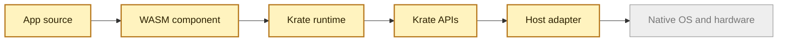

# Introduction

> **Naming:** The project was renamed from **Layer36** to **Krate** (by Krate Labs) in July 2026. Code, commands, and `krate:*` API namespaces keep the legacy name until the scheduled code-level rename lands. Docs may use both names during the transition.

Krate is an attempt to make apps portable in the way files are portable.

The goal is simple to say and hard to build:

> Write one app. Run it on Windows, Linux, macOS, Android, iOS, ChromeOS, and
> the web through the same Krate runtime model.

Today every platform has its own SDK, app format, permission model, UI rules,
and hardware APIs. That is why the same product often becomes six different
codebases. Krate puts one common layer in the middle.

## The Core Idea

An app compiles to WebAssembly. The app does not call Windows, Android, or iOS
directly. It calls Krate APIs. Each host then translates those calls into the
native platform underneath.

What exists today is a pre-alpha runtime that already delivers the founding
claim on desktop. Krate runs WebAssembly components through the CLI on Linux,
macOS, and Windows from byte-identical artifacts, routes app calls through
UAPI modules, and enforces manifest-declared capabilities before any host
access. The first GUI component opens a real native window on macOS (native
button and text field, human-verified click round trip) and real winit
windows on Linux and Windows — proven in CI — with the first drawn-widget
pass painting the UI in those windows. AI agents can execute components in
the sandbox through an embedding API, `krate run --json`, and an MCP
server, receiving permission decisions as data. Mobile hosts, bundles, and
distribution are still later work.

## What We Have Built So Far

- A Rust workspace and public GitHub project.
- A `krate` CLI with `run`, `version`, `doctor`, and manifest commands.
- A Wasmtime based runtime that loads WebAssembly components.
- Phase 2 UAPI slices for `io`, `fs`, `net`, `time`, and `locale`.
- UCap manifests, launch grants, policy checks, and grant logs.
- Sample apps for `krate-clock`, `krate-cat`, and `krate-curl`.
- CI and evidence scripts for samples, UCap enforcement, language variants,
  adapter boundaries, benchmarks, and exit readiness.
- The Phase 3 GUI path: `ui`/`gfx`/`audio` WIT drafts, a widget tree with
  Taffy layout, a UCap-gated UI dispatcher, native AppKit windows and
  widgets on macOS, winit windows on Linux and Windows, the first drawn
  widget pass, and the `krate-hello-gui` sample (import-pure, runs on all
  three OSes, `sh scripts/demo-hello-gui.sh`).
- Shareable apps: `krate pack` writes a single `.krate` file carrying the
  component and the permissions it asks for; `krate run` takes that file or
  an https URL to one. Fetching grants nothing.
- The agent surface: `krate_runtime::embed`, `krate run --json`
  (schema `krate.run.v1`), and `krate-mcp-server` with two tools —
  `inspect_bundle` to see what an app wants before running it, and
  `run_component` to run it, whose denials carry the exact retry that
  would succeed.
- A prerelease, `v0.1.0-rc1`, with platform archives and checksums.
- Docs, threat models, benchmarks, architecture records, and Phase 2 exit
  evidence pages.

## What We Have Not Built Yet

- The full GUI surface: the vello renderer, richer widgets, text input and
  IME, accessibility trees, dialogs, menus, and the `krate-notes`
  flagship (windows and first widgets exist; the rest of the surface does
  not yet).
- Graphics (`gfx`) and audio beyond honest `unsupported` stubs; sensors,
  identity, and production app lifecycle APIs.
- A `.krate` bundle format.
- Mobile hosts.
- Security strong enough for untrusted third party apps.
- A finished developer SDK or app store.
- A formally frozen Phase 2 UAPI.
- External developer validation.

So the honest status is: **the runtime proof is real on all three desktop
OSes — windows included — but the platform is not done**.

## Why WebAssembly?

WebAssembly gives Krate a portable, compact, sandboxed program format. The
Component Model gives it typed interfaces between app code and host code. WIT
lets us describe those interfaces in a language neutral way.

Krate is the missing product layer around those pieces: APIs, permissions,
host adapters, tools, packaging, and distribution.
