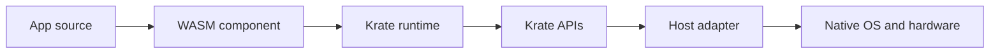

# Introduction

Krate is a way to build a desktop app and ship it as one file.

You write Rust. It compiles to a WebAssembly component. Krate packs that
component, its manifest and its own source into a single `.krate` file.
The same application bytes run on macOS, Windows and Linux through native
Krate runtimes. The recipient installs a compatible runtime once; the app
does not need a separate package for each operating system. Existing desktop
binaries do not become portable without adapting them to supported Krate APIs.

Apps begin without file or network access. Capabilities are declared in the
manifest and approved through the runtime. This is an enforced boundary, not
a promise of bug-free or harmless software. Read the [threat model](phase2/threat-model-v0-2.md)
and only run apps you trust. You can inspect an app's requests without running it:

```sh
krate run app.krate --dump-caps
```

## Where to start

- **[Quickstart](quickstart.md)** if you want a running app in a few minutes.
- **[Porting](porting.md)** if you have a project already.
- **[What Krate cannot do yet](limits.md)** before you spend a weekend. It is
  written from `krate manifest capabilities` rather than from memory, and it
  says plainly what is missing.

## What is real today

Desktop, on Intel and ARM: macOS, Windows and Linux, from byte-identical
artifacts. Components run through the CLI or the embedding API, GUI apps open
real native windows, and capabilities are enforced before any host access.
Agents can drive the whole thing through `krate run --json` and an MCP server,
receiving permission decisions as data.

Rust is the only language you can ship a window from today. iOS and Android
exist in the tree as reference ports and are not shipping. The
[limits page](limits.md) keeps the honest list.

## The Core Idea

An app compiles to WebAssembly. The app does not call macOS, Windows, or Linux
directly. It calls Krate APIs. Each host then translates those calls into the
native platform underneath.


```mermaid
flowchart LR
    A["App source"] --> B["WASM component"]
    B --> C["Krate runtime"]
    C --> D["Krate APIs"]
    D --> E["Host adapter"]
    E --> F["Native OS and hardware"]

```

## What ships

- A Wasmtime-based runtime and native desktop host adapters.
- A Rust SDK for applications, with typed host interfaces and capability checks.
- `krate pack` and `krate run` for sharing and opening `.krate` bundles.
  Downloading a bundle does not grant its requested capabilities.
- Krate Studio for AI-assisted app creation and revision, alongside the CLI
  and embedding interfaces.
- A gallery, examples, capability reference and automated checks.

The [latest published release](https://github.com/incyashraj/krate/releases/latest)
lists downloadable artifacts and release notes. This documentation tracks the
repository; an older installed runtime may not support a newer bundle profile
or interface. Check `krate version` and the relevant release notes.

## Boundaries and measurements

The [limits page](limits.md), [interface coverage](reference/interface-parity.md)
and [widget coverage](reference/widget-parity.md) describe the supported surface.
Mobile is not a shipping target. Krate is under active development; neither
universal compatibility nor production hardening against hostile code is implied.

The file you share is not just its code payload: source, SDK interfaces and
assets can add to its size. The runtime is a separate, platform-specific
installation. The [measurement report](https://krate.tech/reports/) separates
those costs and scopes performance results to the workload, machine and version
that were actually tested.

## Why WebAssembly?

WebAssembly gives Krate a portable, compact, sandboxed program format. The
Component Model gives it typed interfaces between app code and host code. WIT
lets us describe those interfaces in a language neutral way.

Krate is the missing product layer around those pieces: APIs, permissions,
host adapters, tools, packaging, and distribution.
