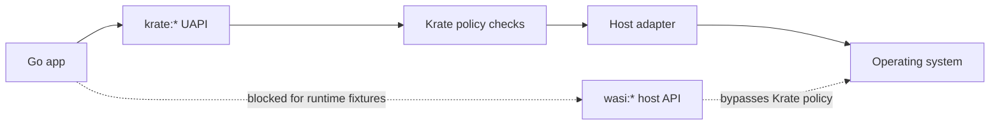

# Go Readiness Evidence

This page records the current Phase 2 state for Go.

The short version: the Go examples build with TinyGo, but they are not runtime
fixtures yet. They still import some WASI host APIs directly. Phase 2 keeps them
out of the runtime fixture set until those imports are replaced by `krate:*`
UAPI imports.

## Why This Matters

Krate is trying to make apps portable by keeping host access behind one small
runtime boundary.

For Go, that means a compiled component should call Krate UAPI packages such
as `krate:io`, `krate:fs`, and `krate:net`. It should not reach around
the runtime and call `wasi:filesystem`, `wasi:stdio`, or other host APIs
directly.

That rule keeps the security model simple:



## Run The Recorder

From the repo root:

```bash
scripts/record-phase2-go-readiness-evidence.sh
```

Default output:

```text
target/phase2-go-readiness-evidence/go-readiness-evidence.md
```

For an exit-style check that fails when Go is not import-pure:

```bash
scripts/record-phase2-go-readiness-evidence.sh --strict
```

## What It Records

The report includes:

- git commit, host OS, host architecture, and timestamp
- Go, TinyGo, and `wasm-tools` versions
- TinyGo smoke build result for clock, cat, and curl
- import-purity result for the three compiled components
- SHA-256 hashes for the smoke artifacts
- the full import-purity log tail

## Current Decision

Go is still a Phase 2 binding track, but not a promoted runtime fixture track.

The accepted Phase 2 decision is:

- keep Go SDK source, examples, shape checks, and TinyGo build smoke
- keep Go runtime fixture promotion gated by import purity
- do not claim Go runtime parity until the compiled artifacts import only
  `krate:*`
- mark Go runtime parity as experimental for this phase
- carry the import-pure runtime proof into the next phase if it is not ready
  before the Phase 2 freeze

That is not a failure of direction. It is the correct boundary doing its job.

The fuller decision note is here: [Go Phase 2 Decision](go-phase2-decision.md).
