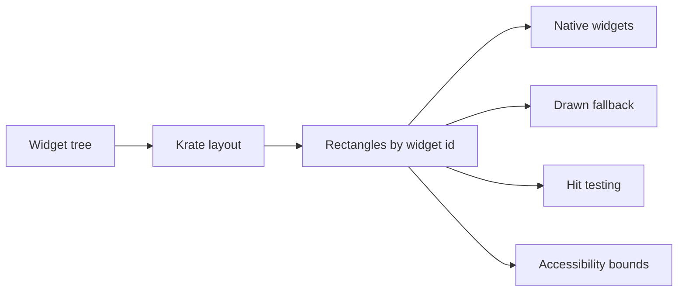

# Layout

Layout is the step that turns a widget tree into rectangles.

For example, the app may say:

- here is a window
- inside it is a vertical stack
- inside the stack are a title, a note list, and an editor

The layout engine decides where each part sits and how much space it gets.

## Why It Matters

Krate has two UI paths:

- native widgets, when the host has a real matching control
- drawn fallback widgets, when it does not

Both paths need the same layout answer. If a native button and a drawn canvas do
not agree on positions and sizes, input, accessibility, screenshots, and redraws
will drift.



## What Exists Now

The first layout crate exists:

```text
crates/layout/
```

It does these things today:

- takes a validated `WidgetTree`
- maps it into Taffy
- computes logical rectangles for each `WidgetId`
- returns a `LayoutSnapshot` keyed by stable widget IDs
- returns absolute rectangles when code needs root-window coordinates
- can hit-test a point and return the deepest widget under that point
- has generated tests for 100 different layout shapes
- can prepare a layout tree once and reuse it for repeated layout passes

The runtime can now ask for a layout snapshot for a stored draft widget tree.
That means the path is already connected to the Phase 3 dispatcher, not only a
standalone library.

The runtime can also ask for a `PreparedLayoutTree`. That is the path future
event loops should use when a widget tree stays mostly the same across many
frames.

## What This Does Not Mean Yet

This does not draw a UI.  
This does not open a native window.  
This does not freeze the Phase 3 style model.

It means the shared geometry step has started. Native widgets, drawn fallback,
hit testing, and accessibility can now build on one rectangle map.

## Current Shape

The first style block is intentionally small:

| Field | Meaning |
|---|---|
| `width` | optional logical width |
| `height` | optional logical height |
| `grow` | flex grow factor |
| `padding` | same padding on all sides |

The first layout pass treats stack-like widgets as vertical flex containers.
That is enough for early notes app screens and for testing the runtime boundary.

## Hit Testing

Layout rectangles are also the base for input routing. The first helper can take
a point, walk the computed layout, and return the deepest widget that contains
that point.

That is still a headless helper. It is not connected to mouse, touch, or pointer
events yet. The important part is that future input routing will use the same
rectangles as native widgets and drawn fallback rendering.

## Benchmark Shape

The repo now has a Criterion benchmark target for layout:

```bash
cargo bench -p krate-layout --bench layout
```

It includes 1,000-node and 10,000-node stack-like trees. The benchmark is a
measurement tool today, not a Phase 3 exit proof yet. Before exit, we still need
recorded numbers on the target hosts and a pass or fail decision against the
Phase 3 budget. The first local run shows optimization is still needed before
the 10,000-node target can be treated as ready.

The prepared layout path is the first optimization step. Locally, repeated
10,000-node layout passes are now under the Phase 3 budget, while cold rebuilds
are still above it. That fits the planned reconciler model: build or update the
engine tree when widgets change, then reuse it for frame layout.

## Next Steps

- add more style fields only when the notes app needs them
- record prepared and cold layout benchmark numbers on Linux, macOS, and Windows
- connect hit testing to real input events
- connect layout rectangles to accessibility bounds
- use the same rectangles when native window work starts
