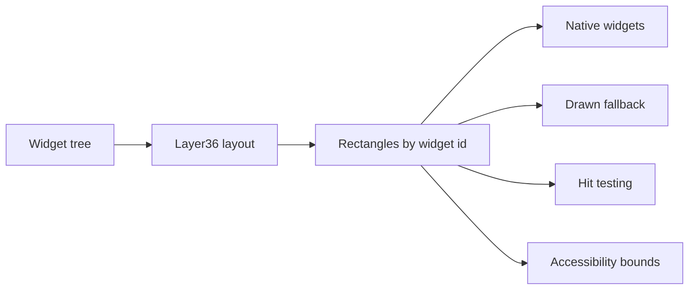

# Layout

Layout is the step that turns a widget tree into rectangles.

For example, the app may say:

- here is a window
- inside it is a vertical stack
- inside the stack are a title, a note list, and an editor

The layout engine decides where each part sits and how much space it gets.

## Why It Matters

Layer36 has two UI paths:

- native widgets, when the host has a real matching control
- drawn fallback widgets, when it does not

Both paths need the same layout answer. If a native button and a drawn canvas do
not agree on positions and sizes, input, accessibility, screenshots, and redraws
will drift.



## What Exists Now

The first layout crate exists:

```text
crates/layout/
```

It does four things today:

- takes a validated `WidgetTree`
- maps it into Taffy
- computes logical rectangles for each `WidgetId`
- returns a `LayoutSnapshot` keyed by stable widget IDs

The runtime can now ask for a layout snapshot for a stored draft widget tree.
That means the path is already connected to the Phase 3 dispatcher, not only a
standalone library.

## What This Does Not Mean Yet

This does not draw a UI.  
This does not open a native window.  
This does not freeze the Phase 3 style model.

It means the shared geometry step has started. Native widgets, drawn fallback,
hit testing, and accessibility can now build on one rectangle map.

## Current Shape

The first style block is intentionally small:

| Field | Meaning |
|---|---|
| `width` | optional logical width |
| `height` | optional logical height |
| `grow` | flex grow factor |
| `padding` | same padding on all sides |

The first layout pass treats stack-like widgets as vertical flex containers.
That is enough for early notes app screens and for testing the runtime boundary.

## Next Steps

- add more style fields only when the notes app needs them
- add a benchmark for large widget trees
- connect layout rectangles to hit testing
- connect layout rectangles to accessibility bounds
- use the same rectangles when native window work starts
