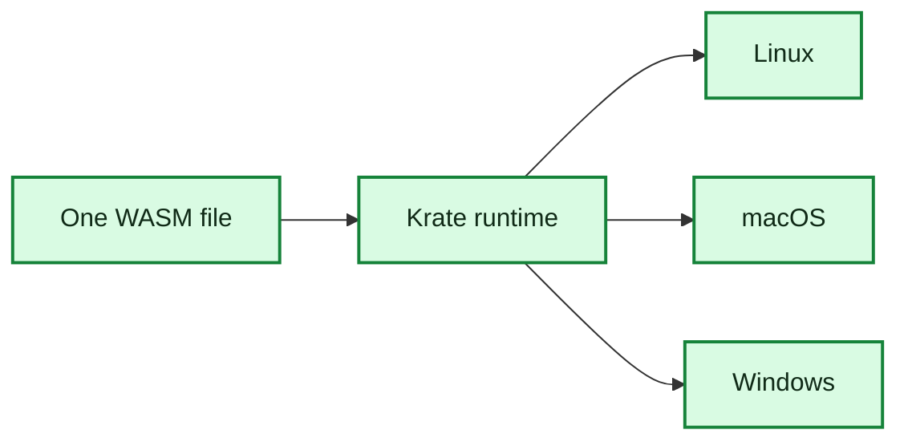

# Phase 1: Runtime Proof

**Status:** Engineering done; historical proof path retained
**Estimate:** done
**Goal:** Prove one `.wasm` file runs through Krate on Linux, macOS, and
Windows.

## Done

- `crates/runtime` embeds Wasmtime.
- `crates/cli` builds the `krate` command.
- `krate run`, `krate version`, and `krate doctor` work.
- A small hello-world WASM component prints `Hello, Krate!`.
- Runtime fuel and memory limits fail with clear errors.
- CI builds one hello `.wasm` artifact and runs the same bytes on Linux, macOS,
  and Windows.
- `v0.1.0-rc1` is published with five archives and `SHA256SUMS`.
- Quickstart, architecture notes, benchmarks, threat model, and retrospective
  are published.
- ADR-0002 and ADR-0003 are merged.

## What This Means

We have proven the base runtime path:

That is a real milestone. It does not mean Krate can run full apps yet. It
means the engine can load a portable component and execute it consistently on
three desktop hosts.

## Current Role

Phase 1 is no longer the active development path. It remains in the repository
as the original proof that one `.wasm` artifact can run through the Krate
runtime. The active app model is Phase 2.

For new app work, use the Phase 2 UAPI path. See
[Migrating From Phase 1 To Phase 2](../phase2/migrating-from-phase1.md).
