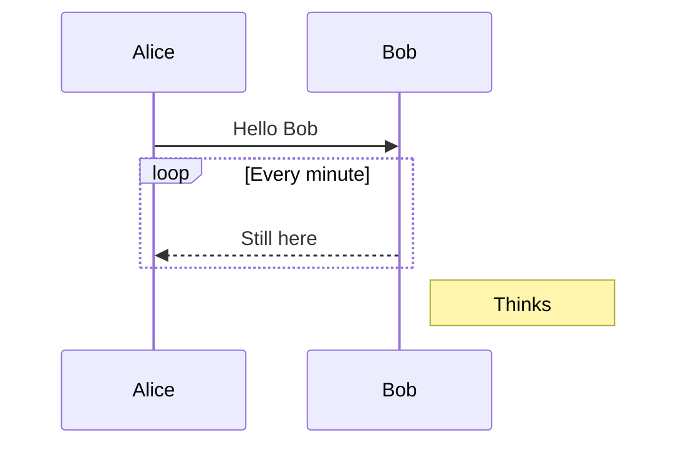
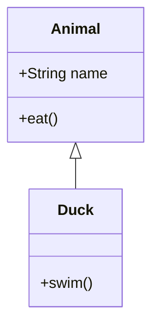
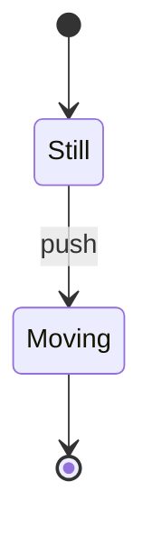

# Diagrams 1

```mermaid
sequenceDiagram
    participant A as Alice
    participant B as Bob
    A->>B: Hello Bob
    loop Every minute
        B-->>A: Still here
    end
    Note right of B: Thinks
```

```mermaid
classDiagram
    class Animal {
        +String name
        +eat()
    }
    Animal <|-- Duck
    Duck : +swim()
```

```mermaid
stateDiagram-v2
    [*] --> Still
    Still --> Moving : push
    Moving --> [*]
```
