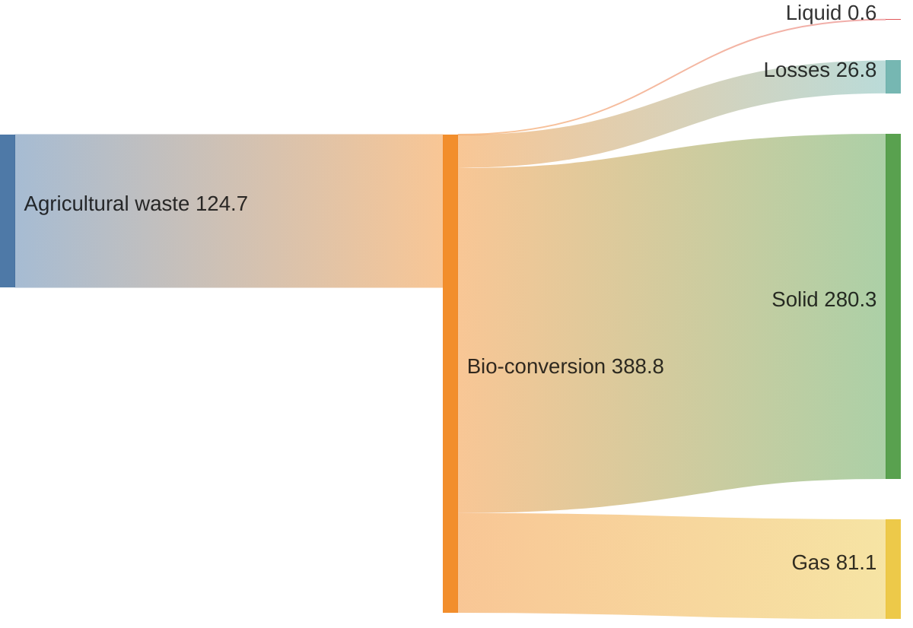

# Diagrams 5

```mermaid
sankey-beta
Agricultural waste,Bio-conversion,124.7
Bio-conversion,Liquid,0.6
Bio-conversion,Losses,26.8
Bio-conversion,Solid,280.3
Bio-conversion,Gas,81.1
```

```mermaid
block-beta
columns 3
a["Input"] b["Process"] c["Output"]
d["Logs"]:3
```
