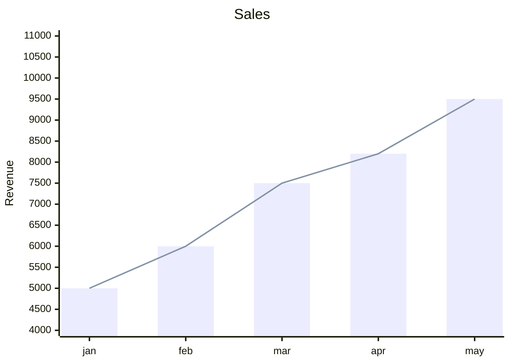
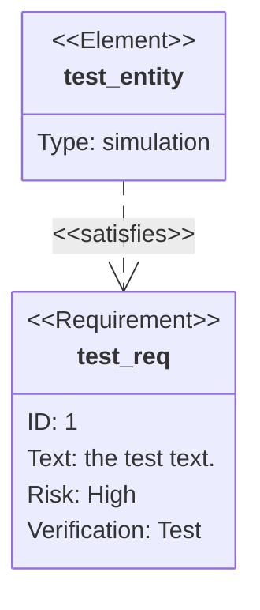

# Diagrams 6

```mermaid
xychart-beta
    title "Sales"
    x-axis [jan, feb, mar, apr, may]
    y-axis "Revenue" 4000 --> 11000
    bar [5000, 6000, 7500, 8200, 9500]
    line [5000, 6000, 7500, 8200, 9500]
```

```mermaid
requirementDiagram
    requirement test_req {
    id: 1
    text: the test text.
    risk: high
    verifymethod: test
    }
    element test_entity {
    type: simulation
    }
    test_entity - satisfies -> test_req
```
