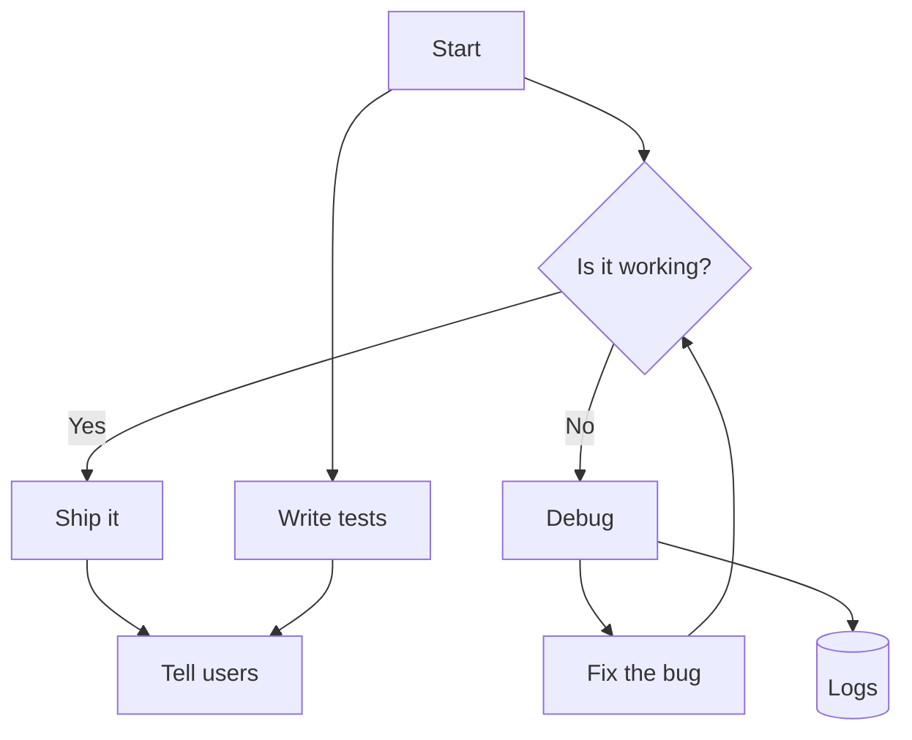
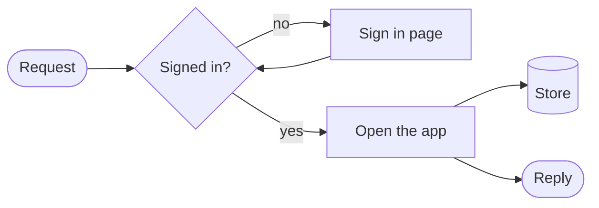

# Flowchart

```mermaid
flowchart TD
    A[Start] --> B{Is it working?}
    B -->|Yes| C[Ship it]
    B -->|No| D[Debug]
    D --> E[Fix the bug]
    E --> B
    C --> F[Tell users]
    A --> G[Write tests]
    G --> F
    D --> H[(Logs)]
```

```mermaid
graph LR
    In([Request]) --> Auth{Signed in?}
    Auth -- no --> Login[Sign in page]
    Login --> Auth
    Auth -- yes --> App[Open the app]
    App --> Data[(Store)]
    App --> Out([Reply])
```
