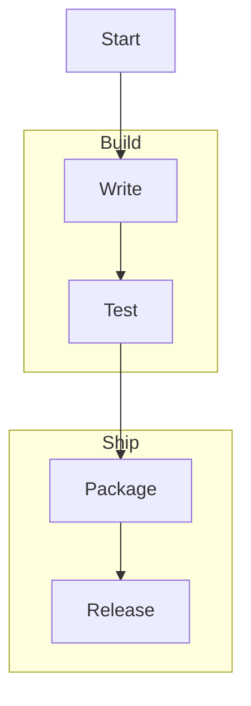

# Subgraphs

```mermaid
flowchart TD
    subgraph one [Build]
      a1[Write] --> a2[Test]
    end
    subgraph two [Ship]
      b1[Package] --> b2[Release]
    end
    a2 --> b1
    c[Start] --> a1
```
